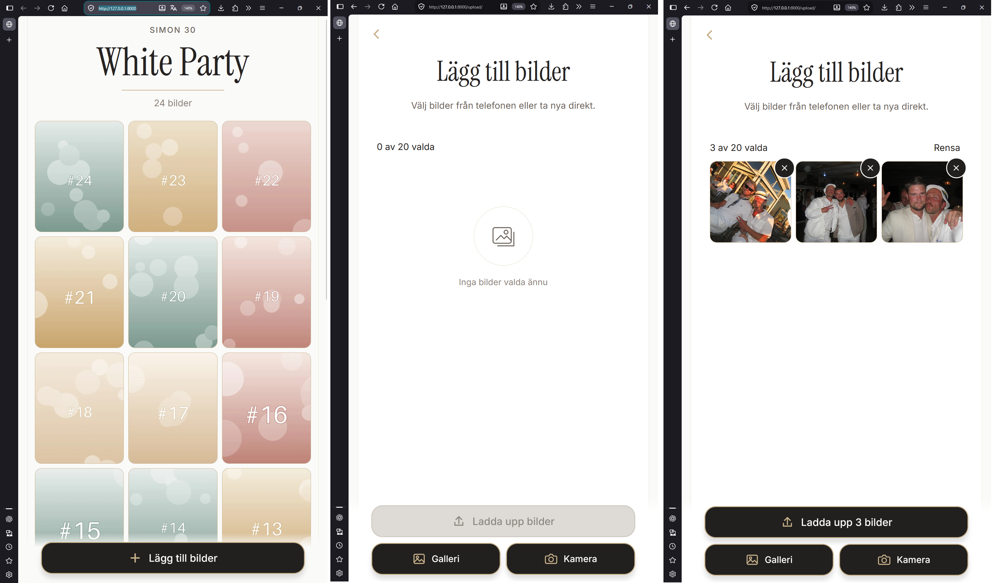

# Event Guestbook

A QR-based shared photo album for a single event, built with Django.

Guests scan a QR code, join without an account, upload photos from their
phone and browse everyone's pictures in one shared feed.



## Status

Built for a friend's 30th birthday in August 2026. Guests scanned a QR
code on the tables and uploaded 134 photos during the evening.

The deployment has been shut down and the album archived offline. This
repository is a finished single-event project and is not maintained.
The ideas continue in a separate wedding-site project.

## Features

- Guest access through a shared join link (QR code) stored in the
  session, with no user accounts
- Five event phases (`closed`, `pre`, `live`, `post`, `archived`) driven
  by a declarative phase configuration
- Mobile upload with previews, removal, and separate gallery and camera
  actions
- Multiple images per upload, grouped as one post
- WebP thumbnails, regeneratable from the stored originals
- Masonry feed with a fullscreen lightbox (swipe, keyboard, loading
  feedback)
- Moderation through Django Admin

## Demo

```bash
make setup
make demo
```

`make demo` resets the **local** database and media, creates 24
generated photos through the same upload path real guests used, and
starts the server in the LIVE phase. The browser opens automatically
when possible. Otherwise, open:

    http://127.0.0.1:8000/join/demo/

Opening `/` without joining returns 404 by design. After joining once,
the session keeps access.

Without `make`:

```bash
python manage.py migrate
python manage.py seed_demo
DEBUG=True GUESTBOOK_DEV_PHASE=live GUESTBOOK_ACCESS_KEY=demo \
  python manage.py runserver
```

## Development

```bash
make devrun live     # simulate a phase: closed, pre, live, post, archived
make test            # run the test suite
make verify          # system checks, migration check and tests
make help            # all commands
```

Settings are read from `.env`. See `.env.example`.

## Design

| Module | Responsibility |
|---|---|
| `schedule.py` | Works out the current phase from the event dates (pure function) |
| `phase_configuration.py` | What each phase allows: joining, uploads, camera, feed |
| `lifecycle.py` | Connects schedule, configuration and settings |
| `access.py` | Grants and checks guest access in the session |
| `posting.py` | Creates a post and its images; removes stored files if the database step fails |
| `image_processing.py` | Orientation-aware WebP thumbnails |

The originals are the source of truth. Thumbnails are derived and can be
rebuilt with `python manage.py rebuild_thumbnails`.

## Known Limitations

Acceptable for one evening among friends, but worth fixing before reuse:

- No upload progress indicator
- Thumbnails are generated during the upload request
- Originals keep their EXIF metadata, including GPS location
- Media files are served publicly by path; only the pages require the
  join link
- The feed loads every image without pagination
- Event dates are set in `config/settings.py`

## License

MIT
